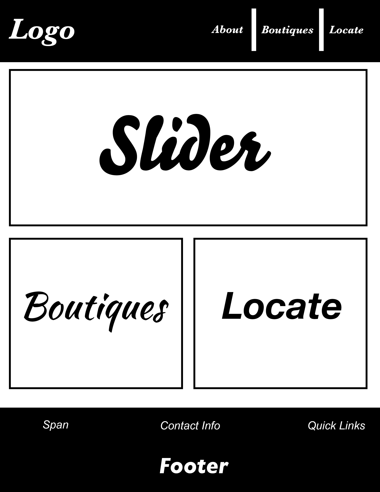

# Local-Co / Kyle's Front End Project

## Uses & Users
Local-Co will be helpful to locate the Men's Colorado local boutiques/brands. Local-Co will show a list of boutiques/brands, the boutique's/brand's specific style, the location, and how far the user is away from the boutique/brand. This would be useful for people who want to support local fashion, but don't know where to go.

## Tech Involved
The front-end will use HTML/CSS infused with a framework, that is yet to be decided, but probably bootstrap for mobile responsiveness. I'll use google maps API to place pins of the boutiques/brands and to tell how far the user is from the boutiques/brands. I'll also include something that will allow the user to use their current location, some NSA shit. Postman will be used for a GET request. Finally some Javascript/Jquery for functionality and to make the site more user friendly.

##Features

###Listing of Boutiques/Brands
1. This will show the all boutiques/brands that are located.
2. The Style of that boutique/brand.
3. The address of that boutique/brand.
4. The phone number and/or email of that boutique/brand to ask questions.
5. The hours of operations of that boutique/brand. 

###Locating User / Closest Store
1. Google maps api, integration so I can place pins of all boutiques/brands.
2. Locating User
3. Comparing distance to each boutique/brand.
4. Finally outputting it so the user can see closest place.

##Stretch Goals
Having each boutique have their own about page, so the user can read a description about the boutique/brand from the boutique/brand.

##Pivotal Tracking
This projects tracking is on [Pivotal Tracker Board](https://www.pivotaltracker.com/n/projects/1525923)

